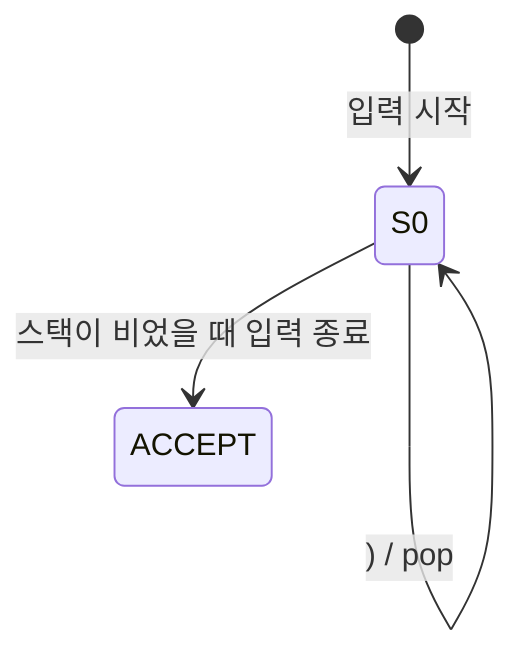
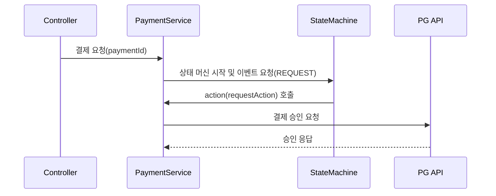

# 🤿 숨 꾹 참고 딥다이브 2 : 유한 상태 기계 (Finite State Machine)

- [🤿 숨 꾹 참고 딥다이브 : 유한 상태 기계 (Finite State Machine)](#-숨-꾹-참고-딥다이브--유한-상태-기계-finite-state-machine)
  - [🤟 Intro](#-intro)
  - [🧐 상태 (State) 에 대한 이해](#-상태-state-에-대한-이해)
  - [🧠 유한 상태 기계 (Finite State Machine) 에 대한 이해](#-유한-상태-기계-finite-state-machine-에-대한-이해)
    - [🧩 핵심 요소](#-핵심-요소)
    - [🎯 왜 유한해야 할까요??](#-왜-유한해야-할까요)
  - [📚 컴퓨터공학 이론 이야기 : 오토마타 이론과 튜링 머신](#-컴퓨터공학-이론-이야기--오토마타-이론과-튜링-머신)
    - [📝 개요](#-개요)
    - [🏗️ 오토마타 이론 (Automata Theory) 소개](#️-오토마타-이론-automata-theory-소개)
    - [🧮 계산 이론 (Theory of Computation)](#-계산-이론-theory-of-computation)
    - [🖨️ 튜링 머신 (Turing Machine)](#️-튜링-머신-turing-machine)
      - [❓ 그럼 이걸 왜 만들었을까?](#-그럼-이걸-왜-만들었을까)
      - [⚖️ 유한상태기계 vs 튜링 머신](#️-유한상태기계-vs-튜링-머신)
  - [⚙️ 컴퓨터공학 이론 이야기 : 컴파일러](#️-컴퓨터공학-이론-이야기--컴파일러)
    - [🧬 컴파일러 이론 (Compiler Theory)](#-컴파일러-이론-compiler-theory)
  - [🌱 실무 이야기 : Spring State Machine](#-실무-이야기--spring-state-machine)
    - [✅ Spring State Machine이란?](#-spring-state-machine이란)
    - [💡 언제 쓰면 좋을까?](#-언제-쓰면-좋을까)
    - [🧩 Spring State Machine 의 구성요소](#-spring-state-machine-의-구성요소)
      - [🛑 상태 (State)](#-상태-state)
      - [🚦이벤트 (Event)](#이벤트-event)
      - [🔀 전이 (Transition)](#-전이-transition)
      - [🛡️ 가드 (Guard)](#️-가드-guard)
      - [🎬 액션 (Action)](#-액션-action)
      - [📦 ExtendedState](#-extendedstate)
    - [💳 결제 서비스 예제로 보는 Spring State Machine](#-결제-서비스-예제로-보는-spring-state-machine)
      - [✍️ 로직 작성](#️-로직-작성)
      - [🧪 로직 테스트](#-로직-테스트)
    - [⚠️ Spring State Machine 도입 시 고려해야 할 점?](#️-spring-state-machine-도입-시-고려해야-할-점)
    - [⏱️ 심화 : 결제 세션 관리 예제](#️-심화--결제-세션-관리-예제)
  - [🚪 Outro](#-outro)
  - [🔖 Reference](#-reference)

## 🤟 Intro

다시 돌아왔습니다. 여전히 데이터를 상하차 하고 있는 소프트웨어 잡부 손우진입니다.

이번 포스팅에서는 유한 상태 기계 (Finite State Machine) 라는 개념을 가져왔습니다.

Computer Science, 흔히 말하는 컴퓨터공학을 전공 한 사람에게는 오토마타 혹은 컴파일러 이론 시간에 들어보셨을지도 모르겠습니다. 전공시간에 참 재밌게 들었지만 막상 당시의 지식으로 모든 걸 이해하긴 어려웠던 기억이 납니다.

이번 포스팅에서는 이 `유한 상태 기계` 에 대한 컴퓨터공학 이론 이야기와 실무 사례에 대해 이야기 해 볼까 합니다.

개발자 외에도 많은 사람들이 재밌게 읽을 수 있도록 최대한 코드는 배제하고 작성 해 보도록 하겠습니다. (말 처럼 쉽게 지켜지진 않지만...노력 해 보겠습니다. 🤟)

그럼 한번 숨 꾹 참고 딥 다이브! 시작하겠습니다.

---

## 🧐 상태 (State) 에 대한 이해

우선 상태 라는 것에 대해 한번 짚고 넘어가겠습니다. 상태라는 단어의 사전적 정의는 아래와 같습니다.

> 상태, 狀態 사물·현상이 처해 있는 형편이나 모양.

소프트웨어의 세계에서 사물이라고 할 수 있는 건 작은 데이터 단위 하나 부터 흔히 객체라고 부르는 의미 있는 데이터 덩어리라고 할 수 있습니다.

간단히 신호등 소프트웨어를 생각 해 봐도 신호가 3 개의 상태로 나뉘죠. 빨간등, 노란등, 초록등 이렇게요.

> 🧐 : 아니 우리는 신호등에 상태가 4개가 있는데요?  
> 😊 : ...👊👊

상태는 계속해서 변하는 특성을 가지고 있습니다. 만약 변하지 않는다면 그건 상태라고 부르지 않아요. 상수 (Constant) 라고 부르죠. 신호등이 상태가 변하지 않는 상태라면 신호등으로써 의미가 없죠.

---

## 🧠 유한 상태 기계 (Finite State Machine) 에 대한 이해

상태는 고정 되어있지 않습니다. 변하는 특성을 가지고 있는데, 이 상태가 변하는 조건을 흔히 말해서 이벤트라고 합니다.

> 🥳 : 뭐요 이벤트? 집 앞에 식자재 마트에서 타임 세일을 한다구요?  
> 😊 : 👊... 그래요 그것도 맞긴 합니다. 해당 조건에 의해 제 지갑이 열리니까요.

신호등의 상태가 변하는 조건으로는 시간이 있겠죠. 전체 사이클을 만약 5분으로 잡는다면, 그 중 3분 55초는 빨간불, 5초간 노란불, 1분간 초록불을 할당하는 식으로 조건을 걸거에요. 5분이 끝나면 다시 사이클을 돌릴겁니다.

상태가 이벤트에 따라 변하는 것을 **상태의 전이 (Transition)** 라고 말합니다. 이벤트가 발생하면 어떤 상태로 바뀌어야 하는 지에 대한 수학적 모델을 '유한 상태 기계 (Finite State Machine)' 또는 '유한 오토마톤 (Finite Automaton)' 이 라고 합니다. **수학이라는 말이 나와서 흠칫 하신 분들은 걱정 마세요. 이번 포스팅에서 숫자는 최대한 배제 할테니까요.**

오토마타 라는 단어는 '정해진 규칙에 따라 입력을 읽으면서 내부의 상태를 바꾸고 결과를 출력하는 기계의 수학적 모델' 이라는 의미를 담고 있습니다. '자동'을 의미하는 그리스어 'αὐτόματα'에서 유래했죠.

---

### 🧩 핵심 요소

FSM은 다음과 같은 구성요소를 가집니다:

- State (상태) : 시스템이 가질 수 있는 유한한 상태들
- Event/Input (입력) : 상태를 변화시키는 자극
- Transition (전이) : 입력에 따라 상태가 어떻게 변하는지에 대한 정의
- Initial State (초기 상태)
- Final/Accepting State (종료 상태) (옵션)

```plainText
예: 커피 주문 FSM
[주문대기] --주문→ [제조중] --완료→ [픽업대기] --수령→ [완료]
```

### 🎯 왜 유한해야 할까요??

상태가 무한하다면 시스템은 예측 불가능해집니다. 설계와 디버깅이 어려워지고, 동작을 증명하기도 어렵죠. 신호등의 상태가 무한이라고 생각 해 볼까요?

> 🚕 : 저기요 아저씨! 빨리빨리 안가요?  
> 🚗 : 아니 #$^#%$& 야 신호등이 이상하다고!

유한 상태란 논리적으로 완전히 정의할 수 있는 상태 집합이라는 뜻입니다.

## 📚 컴퓨터공학 이론 이야기 : 오토마타 이론과 튜링 머신

### 📝 개요

> 여담이지만 컴공이 코딩 배우는 곳이라 오해하시는 분들이 가끔 있으십니다...
>
> 물론 과 특성상 코딩을 많이 하긴 하죠. 개인적으론 코딩을 대학에서 직접적으로 배운 건 1학년때가 마지막이었던 것 같습니다.  
> 2학년 때 객체지향 프로그래밍 수업을 다시 되짚어보면 Java 라는 객체지향 언어의 철학에 대한 이야기를 더 하셨던 것 같습니다. 항상 옛 기억은 뒤늦게 떠올려보면 그때 왜 교수님이 그렇게 설명했는 지 이해가 가곤 하죠...
>
> 제임스 고슬링 빠돌이었던 교수님께서 말씀하셨죠.  
> 👨‍🦲 : 언젠가 이 아저씨처럼 되고싶은 날이 올겁니다 허허...

컴퓨터는 우리가 게임 할 때도 쓰지만 본질적인 목적은 '문제를 풀기 위한 도구' 라고 할 수 있습니다. 그렇다면 이런 질문을 던질 수 있을 것 같아요.

> "컴퓨터는 도대체 어떤 문제를 풀 수 있을까?"  
> "또 어떤 문제는 컴퓨터로는 절대 못 푸는 걸까?"

이런 질문에 답하려는 분야가 '오토마타 이론(Automata Theory)' 이고 이를 포함한 더 큰 틀이 '계산 이론 (Theory of Computation)' 입니다.

즉, 우리가 컴퓨터로 무언가를 만들기 전에,
**“이게 컴퓨터로 해결 가능한 문제인지부터 따져보자”** 라는 질문을 던지는 아주 기초적이고도 중요한 분야인 거죠.

---

### 🏗️ 오토마타 이론 (Automata Theory) 소개

좀 더 구체적으로 들어가볼게요. 오토마타 이론은 계산 능력이 있는 기계와 그 기계를 이용해서 풀 수 있는 문제를 연구하는 분야에요. 너무 길게 이야기하면 재미없으니까 간단히 설명하자면, ‘기계가 어떤 문제까지 풀 수 있을까?’를 따지는 학문이에요.

오토마타는 이산 시간 동안 주어진 입력에 의존해 작동하는 수학적인 기계라고 위키백과에 설명 되어있어요. 여기서 `이산` 이라는 개념이 중요한데, `이산` 은 연속적이지 않고 분리되어 있다는 의미에요.

우리 주제가 딥다이브니 좀 더 깊게 설명하고 넘어가자면, 아날로그와 디지털의 관계를 생각 해 보면 이해하기 좀 더 수월 합니다.

아날로그는 연속적인 값을 가지죠. 당장 책상 위에 있는 아날로그 시계의 초침은 매끄럽게 움직이는 것을 확인할 수 있습니다. 중간 값은 무한히 존재할 수 있어요. 그래서 3초와 4초 사이 어딘가 라는 애매한 순간도 존재할 수 있죠.

하지만 디지털의 세계는 다릅니다. 3초, 4초 각각의 단계의 값만 존재합니다. 중간에 값이 무한히 존재하려면 할 수 있겠지만, 3.333333333초 등 실수의 범위에서 끊어질 수 밖에 없습니다.

컴퓨터에서 보는 모든 값들 하나하나는 이산적인 정보입니다. 키보드 입력부터 실수 값 하나 까지도 말이죠. 컴퓨터가 데이터를 저장하고 다루는 방식이 그렇습니다. 메모리에 실수 값 하나를 저장한다고 가정 해 보면 결국 어느 정도 시점에서 끊어질 수 밖에 없어요. 왜냐면 컴퓨터의 하드웨어의 용량은 한계가 있으니까요.

오토마타는 단계별로 하나의 입력을 받아 처리합니다. 한 입력을 받고 상태를 바꾸고, 다시 입력을 받는 등 끊어진 시간 속에서 움직이는 기계입니다. 뭔가 우리가 작성하고 있는 소프트웨어와 느낌이 비슷하죠?

---

### 🧮 계산 이론 (Theory of Computation)

계산 이론은 크게 세 가지 줄기로 나뉩니다.

| 분야                 | 다루는 질문                            | 예시                        |
| -------------------- | -------------------------------------- | --------------------------- |
| **오토마타 이론**    | 어떤 문제를 풀 수 있는가?              | 정규 표현식, 상태 기계      |
| **계산 가능성 이론** | 어떤 문제는 절대로 못 푸는가?          | 정지 문제 (Halting Problem) |
| **복잡도 이론**      | 얼마나 빠르고 효율적으로 풀 수 있는가? | NP 문제, 알고리즘 성능 분석 |

계산 이론은 단순히 '문제를 푼다' 에서 멈추지 않고 풀 수 있는지, 얼마나 빠르게 풀 수 있는 지, 아예 못 푸는 건 없는지 까지 살펴봅니다.

---

### 🖨️ 튜링 머신 (Turing Machine)

컴공 전공자라면 한 번쯤은 들었을 이름이죠.
컴퓨터의 아버지라고 불리는 앨런 튜링(Alan Turing)이 1930년대에 고안한 개념입니다.
우리가 지금 쓰는 컴퓨터와는 다르게, 튜링 머신은 **현실에 존재하는 기계**는 아니에요.
하지만 이론적으로는 **모든 컴퓨터가 튜링 머신을 흉내 내고 있다**고 할 수 있습니다.

튜링 머신은 굉장히 단순한 구조를 가지고 있어요.
하지만 이 단순한 구조만으로도 우리가 작성하는 대부분의 프로그램을 표현할 수 있습니다.

튜링 머신은 다음과 같은 구성요소로 되어 있어요:

- **무한히 긴 테이프**: 데이터를 읽고 쓸 수 있는 공간이에요. 메모리 같은 역할을 합니다.
- **헤드(Head)**: 테이프 위를 왔다갔다 하면서 데이터를 읽거나 씁니다.
- **상태(State)**: 현재 튜링 머신이 어떤 ‘모드’에 있는지를 나타냅니다. 오토마타에서 배운 상태와 같은 개념입니다.
- **전이 함수**: 현재 상태와 테이프의 문자를 보고, 무엇을 쓸지, 어디로 움직일지, 어떤 상태로 전이할지를 결정하는 규칙입니다.

예를 들어 아주 단순한 튜링 머신 하나를 생각해볼 수 있습니다:
‘0’이 연속으로 주어진 테이프에서, 처음으로 나오는 ‘1’을 만나면 작업을 멈추는 기계.
이건 아주 간단하지만, 그 동작을 상태와 입력, 출력, 이동으로 쪼개보면 튜링 머신의 구조를 따르고 있음을 알 수 있어요.

> 이런 방식은 사실 우리가 작성하는 반복문(while loop)이나 조건문(if-else)과 굉장히 닮아 있어요. 컴파일러 입장에서 보면, 튜링 머신은 아주 단순한 구조지만 프로그래밍 언어의 논리 흐름을 거의 모두 표현할 수 있다는 점이죠.

---

#### ❓ 그럼 이걸 왜 만들었을까?

튜링은 **‘무슨 일이든 자동으로 계산하는 기계’를 상상**했습니다.
그리고 이 기계가 풀 수 있는 문제의 한계가 **계산 가능한 문제(computable problem)** 의 정의가 될 수 있다고 생각했죠.

그래서 이런 기준이 생깁니다:

> “튜링 머신으로 풀 수 있다면, 이 문제는 계산 가능하다.”
> 반대로, “튜링 머신으로도 못 푸는 문제는 계산 불가능한 문제다.”

이 기준은 지금도 계산 이론의 핵심 원칙이에요.
정지 문제(Halting Problem) 같은 고전적인 이슈도, 결국 튜링 머신으로 **풀 수 있는가/없는가**를 따지며 정의됩니다.

> 예를 들어 ‘이 프로그램이 무한 루프에 빠질지 아닐지’를 자동으로 판단하는 문제는 튜링 머신으로도 해결할 수 없다는 것이 정지 문제(Halting Problem)죠.

---

#### ⚖️ 유한상태기계 vs 튜링 머신

유한 상태 기계가 ‘기억 없이 판단하는 기계’라면, 튜링 머신은 ‘기억을 통해 복잡한 흐름을 이해하는 기계’입니다. 마치 계산기와 엑셀 정도의 차이랄까요?

핵심은 **기억 능력**이에요. 한번 정리 해 보았습니다.

| 항목          | 유한 상태 기계(FSM)                      | 튜링 머신                 |
| ------------- | ---------------------------------------- | ------------------------- |
| **기억 공간** | 없음 또는 매우 제한적 (현재 상태만 기억) | 무한 테이프 사용 가능     |
| **계산 능력** | 정규 언어만 처리 가능                    | 이론적으로 모든 계산 가능 |
| **현실 적용** | 정규식, 어휘 분석기 등                   | 컴퓨터 자체의 수학적 모델 |
| **복잡도**    | 단순                                     | 복잡하지만 강력함         |

---

결국 튜링 머신은 우리가 오늘날 사용하는 컴퓨터의 **수학적 모델**이자,
**"컴퓨터가 어디까지 할 수 있는지"** 를 규정해주는 가장 중요한 개념이에요.

---

## ⚙️ 컴퓨터공학 이론 이야기 : 컴파일러

### 🧬 컴파일러 이론 (Compiler Theory)

컴파일러는 우리가 작성한 고수준 언어(Java, Kotlin, C 등)를 컴퓨터가 이해할 수 있는 저수준 언어(기계어 등)로 번역하는 프로그램입니다.
그리고 그 내부엔 우리가 앞서 이야기한 오토마타 이론이 아주 깊이 녹아 있죠.

이번 세션에서는 컴파일러의 동작 단계를 알아 보겠습니다. 각 단계별로 상태의 흐름을 알아보기 위해 상태 다이어그램 (State Diagram) 또한 그려볼게요.

컴파일러는 일반적으로 아래와 같은 단계로 동작합니다.

먼저 어휘 분석 (Lexical Analysis) 단계입니다. 소스 코드를 토큰(Token)이라는 최소 의미 단위로 나눕니다.
여기서 **유한 상태 기계(FSM)** 가 활약합니다. 예를 하나 들어볼게요. `int`, 정수 자료형 키워드를 인식하는 상태 다이어그램을 한번 그려볼까요?

<center>
  
</center>

입력 스트림에서 i → n → t 순으로 읽히면 int라는 키워드 토큰으로 인식합니다. 그 외 입력이 오면 다른
상태로 전이하거나 거부 상태로 이동할 수 있습니다.

또 다른 예시로 숫자를 인식하는 예시를 보겠습니다. 12345 처럼 여러 자리 정수를 인식하는 상태 다이어그램을 그려 보겠습니다.

<center>
  
</center>

하나 이상의 숫자를 읽으면 DIGIT 상태에 머무르며 숫자를 계속 누적합니다. 이후 공백이나 다른 기호가 오면 상태 종료되고 토큰이 반환되죠.

다음으로 구문 분석 (Syntax Analysis) 단계입니다. 문법 구조를 분석하여 파싱 트리를 생성합니다. **문맥 자유 문법(Context-Free Grammar)** 을 처리하기 위해 스택 기반 오토마타(PDA) 를 사용합니다. 스택이라는 이름에 맞게 데이터를 메모리에 쌓아두죠.

> 스택에 대해 간단히 설명 해 주자면 데이터를 쌓아두는 데이터 구조 (흔히 말하는 자료구조) 입니다.
>
> 먼저 들어온 데이터가 마지막에 나가는 First In Last Out (FILO) 구조를 가지죠. 우리가 이불을 개어서 쌓아두면 맨 밑에 있는 걸 빼진 않듯이 스택도 마찬가지입니다.
>
> 데이터를 쌓는 명령을 일반적으로 `push` 빼는 명령을 `pop` 이라고 합니다.

예를 들어볼까요? 중첩 괄호 `((()))` 를 인식하는 상태 다이어그램을 그려볼게요.



여는 괄호 (를 읽으면 스택에 push 합니다. 닫는 괄호 )를 읽으면 스택에서 pop 하죠.

스택이 정확히 비어야 ACCEPT 상태로 진입 하게 됩니다. 최종적으로 중첩 괄호를 얻게 되죠.

> 아마 코딩 공부하시는 분들은 알고리즘 문제 풀 때 이런 문제 많이 겪어보셨을겁니다. 스택을 활용할 수 있는 지 묻는 문제죠.

마지막으로 의미 분석, 중간 코드 생성, 최적화 단계입니다. 점점 추상화된 표현을 더 효율적인 코드로 바꾸고 최종 목적 코드로 변환하죠.

예를 들어 `int x = 2 + 3;` 라는 코드를 컴파일러가 분석하는 과정을 구체적으로 설명 해 볼게요.

먼저 어휘 분석 단계입니다.
입력이 int, x, =, 2, +, 3, ; 각각으로 구분될 수 있죠. 그 결과 아래와 같이 토큰이 생성됩니다.

`[Keyword:int], [Identifier:x], [Operator:=], [Literal:2], [Operator:+], [Literal:3]`

다음으로 구문 분석 단계입니다. AST 는 Abstract Syntax Tree 혹은 단순히 Syntax Tree 라고 불려요. 프로그래밍 언어로 작성된 소스 코드의 추상 구문 구조의 트리 입니다.

> 여기서 트리가 무엇인가요...라고 하시는 분들을 위해 설명 드리자면 일종의 그래프입니다. 각각의 요소들이 연결 되어있는 데이터 구조를 의미해요.
>
> 단, 각각 구성요소 (노드 라고 부릅니다.) 간의 연결 경로를 타고 갔을 때 본인에게 돌아오는 순환이 없어야 합니다. 그냥 일자로 연결 된 구조라면 다시 돌아올 수 있겠죠?

키워드들에 대한 AST 는 아래와 같이 생성됩니다.

```plainText
Assignment
 ├── Identifier(x)
 └── Expression
     ├── Literal(2)
     └── +
     └── Literal(3)

```

다음으로 의미분석 단계입니다. 코드를 각각 토큰으로 나눈 후 노드들이 연결 된 트리로 만들었으니 의미를 분석 해 보아야 겠죠?

- x 가 int 로 선언 되었습니다.
- 2 + 3 의 결과도 int (정수) 입니다. 타입이 일치하네요.
- 심볼 테이블에 x 를 등록합니다. 선언 된 변수들을 저장하는 곳이에요.

다음으로 중간 코드 생성 단계입니다. 컴파일러는 다양한 하드웨어를 지원해야 합니다. 흔히 말하는 컴퓨터 CPU 사양 중에 x86, ARM 같은 용어가 나오잖아요? 이런 CPU 들 각각은 각자의 기계어를 가지고있습니다. 마치 한국인, 중국인이 언어가 다른 것 처럼 말이죠. 컴퓨터에게 프로그래밍 언어를 분석해서 각자 CPU 가 이해할 수 있는 기계어로 바꾸기 전에는 중간 단계의 표현으로 변환 해야 합니다.

흔히 쓰이는 게 3-address-code 인데, 2개의 입력용, 1개의 출력용 메모리 주소를 지정한다고 이렇게 이름이 붙었어요.

```
t1 = 2 + 3
x = t1
```

이렇게 쪼개두면 2 + 3 이라는 표현식이 별도의 변수 (t1) 에 담깁니다. 이후 다른 곳에 재사용되거나 계산을 미리 해버리는 최적화 (Constant Folding) 을 할 수 있죠.

다음으로 최적화 단계입니다. 코드를 더 빠르고, 짧고, 효율적으로 만드는 단계입니다. 아까 언급한 Constant Folding 을 해볼까요?

```
t1 = 2 + 3 → t1 = 5
x = t1 → x = 5
```

이 연산 자체를 컴파일 과정에서 해버려서 프로그램이 실행되는 런타임에 하지 않도록 미리 상수화 해 둡니다.

마지막으로 목적코드를 생성합니다. 우리의 플랫폼 (x86, ARM) 에 따라 다릅니다. 이 목적코드는 어셈블리라고 하는데 CPU 의 기계어를 사람이 이해할 수 있는 정도로 번역 해 둔거라고만 이해해두시면 좋습니다.

```asm
MOV eax, 5
MOV [x], eax
```

값 5를 eax 레지스터에 넣고 eax 값을 메모리주소 x에 저장한다는 뜻입니다.

> 제가 기계어 코딩을 할 줄 아는 건 아닙니다....열심히 찾아가며 예시를 만들었죠.

이렇게 보면 오토마타 이론은 단순히 학부 시절의 골치 아픈 이론이 아니라, 현대 프로그래밍의 가장 핵심적인 기술에 응용되고 있는 구조라는 걸 알 수 있습니다.

---

## 🌱 실무 이야기 : Spring State Machine

지금까지 유한 상태 기계(FSM)의 개념과 그 이론적 배경, 그리고 컴파일러처럼 FSM이 활약하는 대표적인 예제까지 살펴봤습니다.

그런데 이렇게 묻는 분들도 계실 수 있어요.

> "근데... 이걸 우리가 실무에서 왜 써야 하죠?"

좋은 질문입니다. 왜냐하면 대부분의 시스템은 생각보다 훨씬 '상태' 중심으로 흘러가기 때문입니다.

- 사용자가 결제를 눌렀어요.
- 결제 중에 취소할 수도 있고, 실패할 수도 있고, 성공할 수도 있죠.
- 성공하면 배송으로 넘어가고, 배송 중에도 상태는 '출고 완료', '배송 중', '배송 완료' 등으로 계속 바뀌어요.

즉, 시스템 내부에선 **현재 상태(state)** 와 **이벤트(event)** 를 기반으로 다음 동작을 결정해야 하는 흐름이 무수히 많습니다.

그리고 그걸 개발자 입장에서 코드로 풀어보면 어떻게 되냐고요?

> `if (status == "PENDING") { ... } else if (status == "PAID") { ... } else if (...)`  
> 😨 : 점점 괴물이 되어갑니다…  
> 🍝 : 여기 스파게티 시키신 분?  
> 복잡하게 꼬인 코드를 흔히 스파게티 코드라고 합니다. 유지보수를 하기 어려워지죠.

이제 여기서 **Spring State Machine**이 등장합니다.

---

### ✅ Spring State Machine이란?

Spring State Machine은 **복잡한 상태 전이 로직을 선언적으로 구성할 수 있게 도와주는 프레임워크**입니다.  
상태(state), 이벤트(event), 전이(transition)를 코드로 정의하고, 상태가 전이될 때 어떤 액션을 실행할지 지정할 수 있죠.

앞서 오토마타 이론에서 본 구성요소와 비교해보면 거의 똑같습니다.

| 오토마타 구성 요소  | Spring State Machine 대응 개념 |
| ------------------- | ------------------------------ |
| 상태 (State)        | 상태 열거형 (enum) 또는 문자열 |
| 입력/이벤트 (Event) | 전이 트리거용 이벤트           |
| 전이 (Transition)   | `source`, `target`, `event`    |
| 전이 조건/액션      | `guard`, `action` 메서드       |

즉, 학부 시절 어렵게 배운 오토마타 이론이,  
**실제 서비스의 복잡한 상태 흐름을 명확하고 테스트 가능한 코드로 만들기 위한 강력한 무기**로 재등장하는 겁니다.

---

### 💡 언제 쓰면 좋을까?

Spring State Machine은 다음과 같은 상황에서 특히 유용합니다.

- 상태가 3~4개 이상이고, 각 상태마다 **이벤트 조건이나 후처리 로직이 존재**할 때
- 상태 전이가 명확한 프로세스 (결제, 주문, 배송, 승인, 인증 등)를 구현할 때
- 흐름 테스트가 어려운 `if-else` 지옥에서 벗어나고 싶을 때
- 상태에 따라 **비즈니스 로직이 분기되는 경우가 자주 변경**될 때

---

### 🧩 Spring State Machine 의 구성요소

좀 더 구체적으로 Spring State Machine 을 살펴보겠습니다. 오토마타의 구성요소와 대응되는 키워드들이 있는 건 이해했지만, 우리가 이 기술을 써먹기 위해선 각 구성요소들에 대해 정확히 이해하고 넘어가야 합니다.

#### 🛑 상태 (State)

Spring State Machine 에서 상태 (State) 란 시스템이 일정 시점에 처해 있는 논리적 구간이라고 할 수 있습니다. 주로 `enum` 클래스로 선언하죠.

> 여기서 enum 이란?
>
> 값의 집합을 이루는 요소를 뜻하는 데이터 입니다. 열거형이라고도 부르죠.  
> enum 을 구성하는 멤버들 각각은 각자의 의미를 가집니다.  
> 상수들을 모아 둔 것이라 이해해도 좋아요.
>
> 클래스란 또 무엇인가? 라고 질문하실 분도 계실 것 같습니다.  
> 지금은 코드보단 개념에 대한 이야기를 하고 싶으니 간단히만 설명하자면, 기능을 가지고 있는 코드 단위라고 생각 해 주세요.
>
> 이 클래스 라는 설계도를 통해 생성 된 객체들이 상호작용하면서 소프트웨어를 이뤄요. 소프트웨어 개발 방법론 중 '객체지향' 을 사용한다면 이런 방식으로 로직들을 구현할 수 있어요.
>
> 물론 유일한 방법은 아닙니다. 우리에겐 '절차지향' 도 있으니까요.

이 상태 데이터 중 로직을 실행할 때의 상태를 `entry`, 로직이 끝날 때의 상태를 `exit` 이라고 합니다.

```kotlin
enum class PaymentState {
    WAITING, PROCESSING, APPROVED, FAILED, CANCELED
}
```

예를 들어 주문 시스템에서는 결제 대기 -> 결제 중 -> 결제 완료 등의 상태를 가질 수 있습니다.

#### 🚦이벤트 (Event)

상태의 전이를 유발하는 트리거를 의미합니다.

이 또한 `enum` 으로 선언 할 수 있습니다. 이 이벤트들은 외부 입력 또는 내부 호출로 발생할 수 있죠.

```kotlin
enum class PaymentEvent {
    REQUEST, APPROVE, DECLINE, CANCEL
}
```

만약 사용자가 결제 요청 버튼을 클릭하면 `REQUEST` 이벤트가 발생 하게 되겠죠?

#### 🔀 전이 (Transition)

한 상태에서 다른 상태로 이동하는 경로를 정의합니다.

`source`, `target`, `event` 각각을 조합해서 만들죠. 예를 들어볼까요?

```kotlin
transitions
    .withExternal()
        .source(PaymentState.WAITING)
        .target(PaymentState.PROCESSING)
        .event(PaymentEvent.REQUEST)
```

`WAITING` 상태에서 `REQUEST` 이벤트가 발생하면 `PROCESSING` 으로 전이한다는 의미를 가진 코드입니다. 이렇게 각 상태들의 경로를 지정해줄 수 있습니다.

#### 🛡️ 가드 (Guard)

가드 (Guard) 는 특정 조건이 충족 될 때만 전이를 허용하는 boolean (true / false) 조건입니다. 이 경우 조건이 true 일 때만 전이되도록 메소드를 작성할 수 있습니다.

> 🙋‍♂️ 메소드가 뭐에요?
>
> 메소드(method)는 컴퓨터 프로그래밍에서 특정 작업을 수행하는 명령문 집합을 의미합니다.  
> 흔히 함수 (function) 이라고도 하는데 좀 더 부분집합 적인 의미에요.  
> 객체지향 프로그래밍에서는 클래스가 가질 수 있는 기능의 단위를 의미합니다. 범용적으로 쓰이는 작업 단위가 아니라 특정 객체가 가질 수 있는 기능의 단위를 의미하죠.

```kotlin
.guard { context ->
    val paymentId = context.extendedState.variables["paymentId"] as Long
    paymentService.canProcess(paymentId)
}
```

결제가 가능한 상태인 지 확인 한 후에 결제 요청 전이를 하고싶을 때 가드를 사용합니다.

#### 🎬 액션 (Action)

액션 (Action) 은 전이 시점 또는 상태 진입 시 실행할 비즈니스 로직입니다.

```kotlin
.action { context ->
    val paymentId = context.extendedState.variables["paymentId"] as Long
    paymentService.processPayment(paymentId)
}
```

`processPayment` 라는 메소드를 호출해 비즈니스 로직을 처리하는 예시에요. 특정 상태에 진입했을 때 (`PROCESSING` 이 되겠죠?) 이 로직을 호출하라고 프로그래밍 할 수 있죠.

#### 📦 ExtendedState

ExtendedState 는 상태 전이 시점에 공유할 수 있는 전역 상태 저장소입니다. 결제 ID (paymentId) 와 같은 정보를 FSM 안에서 공유할 때 사용하죠.

```kotlin
stateMachine.extendedState.variables["paymentId"] = 123L
```

### 💳 결제 서비스 예제로 보는 Spring State Machine

마침 결제에 대한 예시가 앞서 나오기도 했으니 구체적으로 실무에서 도입 한 예제를 짚어보겠습니다.

사용자가 `결제` 버튼을 누르면 이 로직은 아래와 같은 상태를 가집니다.

- 대기 중 → 처리 중 → 승인됨
- 혹은 중간에 실패, 혹은 사용자 취소
- 또 경우에 따라선 환불, 재승인, 보류 상태도 있을 수 있습니다

이처럼 상태가 명확히 구분되고, 전이가 이벤트로 인해 발생하는 경우 Spring State Machine을 적용하기 좋습니다.

먼저 전체 흐름을 단순화해 시각화해보겠습니다.

```plaintext
[WAITING] --결제 요청→ [PROCESSING]
    |                        |
    |                        +--승인→ [APPROVED]
    |                        +--실패→ [FAILED]
    |                        +--취소→ [CANCELED]
```

#### ✍️ 로직 작성

Spring(Kotlin) 예시로 한번 볼까요? (코드는 최소한으로 작성 해 보겠습니다.)

```kotlin
enum class PaymentState {
    WAITING, PROCESSING, APPROVED, FAILED, CANCELED
}

enum class PaymentEvent {
    REQUEST, APPROVE, DECLINE, CANCEL
}
```

결제 처리에 필요한 상태와 이벤트들을 `enum` 클래스로 선언 해 둡니다.

```kotlin
@Configuration
@EnableStateMachine
class PaymentStateMachineConfig : StateMachineConfigurerAdapter<PaymentState, PaymentEvent>() {

    override fun configure(states: StateMachineStateConfigurer<PaymentState, PaymentEvent>) {
        states
            .withStates()
            .initial(PaymentState.WAITING)
            .end(PaymentState.APPROVED)
            .end(PaymentState.FAILED)
            .end(PaymentState.CANCELED)
            .states(EnumSet.allOf(PaymentState::class.java))
    }

    override fun configure(transitions: StateMachineTransitionConfigurer<PaymentState, PaymentEvent>) {
        transitions
            .withExternal().source(PaymentState.WAITING).target(PaymentState.PROCESSING).event(PaymentEvent.REQUEST)
            .and()
            .withExternal().source(PaymentState.PROCESSING).target(PaymentState.APPROVED).event(PaymentEvent.APPROVE)
            .and()
            .withExternal().source(PaymentState.PROCESSING).target(PaymentState.FAILED).event(PaymentEvent.DECLINE)
            .and()
            .withExternal().source(PaymentState.PROCESSING).target(PaymentState.CANCELED).event(PaymentEvent.CANCEL)
    }
}
```

그리고 이 상태들의 변화에 대한 전이 방향성을 Configuration 코드로 작성할 수 있습니다. 결제 로직의 초기 상태는 `WAITING`, 그리고 `APPROVED`, `FAILED`, `CANCELED` 는 종료 상태죠. 이 상태들의 관계를 `StateMachineStateConfigurer` 에 지정 해 줍니다.

그리고 상태 전이 흐름 관계를 `StateMachineTransitionConfigurer` 에 작성 합니다.

코드가 추상적일 수 있으니 상태 다이어그램을 그려볼까요?

<center>
  
</center>

지금까지 잘 따라 와 주셨습니다. State Machine 을 설정했으니 실제 서비스에 한번 녹여보겠습니다.

Spring MVC 구조 상에서 결제 요청에 대한 로직은 이렇게 흘러갑니다.

```plaintext
Controller (결제 요청) → Service (상태 전이 trigger)
                         ↘ StateMachine → action / entry 실행
```

```kotlin
@Component
class PaymentActions {

    @Bean
    fun requestAction(): Action<PaymentState, PaymentEvent> {
        return Action { context ->
            val paymentId = context.extendedState.variables["paymentId"] as Long
            paymentService.processPayment(paymentId)
        }
    }
}
```

만약 결제 요청이 `PROCESSING` 상태가 되었을 때 실행되어야 할 비즈니스 로직이 결제 로직 호출이라면 위와 같이 코드를 작성할 수 있습니다.

그리고 앞서 작성했던 `Configuration` 코드에 부가 로직을 연결합니다.

```kotlin
transitions
    .withExternal()
        .source(PaymentState.WAITING)
        .target(PaymentState.PROCESSING)
        .event(PaymentEvent.REQUEST)
        .action(paymentActions.requestAction())
```

Service 레이어 (비즈니스 로직 레이어) 에서는 그럼 이렇게 코드를 작성할 수 있습니다.

```kotlin
@Service
class PaymentService(
    private val stateMachineFactory: StateMachineFactory<PaymentState, PaymentEvent>
) {
    /**
    * 결제 요청이 들어오는 경우 제일 먼저 호출되는 메소드
    */
    fun handlePaymentRequest(paymentId: Long) {
        val stateMachine = stateMachineFactory.getStateMachine(paymentId.toString())
        stateMachine.start()
        stateMachine.extendedState.variables["paymentId"] = paymentId
        stateMachine.sendEvent(PaymentEvent.REQUEST)
    }

    /**
    * 결제 로직 시작
    */
    fun processPayment(paymentId: Long) {
        // do something
    }
}
```

결제 요청이 들어왔을 때 `handlePaymentRequest` 메소드부터 호출한다고 생각해보면, 메소드가 호출되었을 때 stateMachine 을 하나 불러옵니다.

전체 흐름을 상태 다이어그램으로 요약하면 아래와 같습니다.



모든 결제 로직이 끝나고 `APPROVED` 상태에 진입했을 때 알람을 보내고 싶다면 아래와 같이 액션을 지정해줄 수도 있죠.

```kotlin
/**
* APPROVED 상태가 되었을 때 Slack, Telegram 등으로 알람 전달
*/
@Bean
fun approvalEntryAction(): Action<PaymentState, PaymentEvent> {
    return Action { context ->
        val paymentId = context.extendedState.variables["paymentId"] as Long
        notificationService.sendApprovalMessage(paymentId)
    }
}

override fun configure(states: StateMachineStateConfigurer<PaymentState, PaymentEvent>) {
    states
        .withStates()
        .initial(PaymentState.WAITING)
        .state(PaymentState.APPROVED, paymentActions.approvalEntryAction(), null)
}
```

#### 🧪 로직 테스트

지금까지 로직을 잘 작성했지만, 개발자 선에서 테스트를 하고 QA 로 넘겨야겠죠?

지금까지 작성한 State Machine 을 Kotest 로 테스트 해 보겠습니다.

```kotlin
import io.kotest.core.spec.style.BehaviorSpec
import io.kotest.matchers.shouldBe
import org.springframework.beans.factory.annotation.Autowired
import org.springframework.boot.test.context.SpringBootTest
import org.springframework.statemachine.StateMachine
import org.springframework.statemachine.config.StateMachineFactory
import org.springframework.test.context.TestPropertySource

@SpringBootTest
@TestPropertySource(locations = ["classpath:application-test.properties"])
class PaymentStateMachineBehaviorSpecTest @Autowired constructor(
    private val stateMachineFactory: StateMachineFactory<PaymentState, PaymentEvent>
) : BehaviorSpec({

    given("결제 상태 머신이 초기화되었을 때") {

        `when`("REQUEST 이벤트를 보내면") {
            then("WAITING → PROCESSING 상태로 전이된다") {
                val machine: StateMachine<PaymentState, PaymentEvent> =
                    stateMachineFactory.getStateMachine("PAYMENT_REQ_1")
                machine.start()

                machine.sendEvent(PaymentEvent.REQUEST)

                machine.state.id shouldBe PaymentState.PROCESSING
            }
        }

        `when`("REQUEST → APPROVE 이벤트를 순서대로 보내면") {
            then("WAITING → PROCESSING → APPROVED 상태로 전이된다") {
                val machine = stateMachineFactory.getStateMachine("PAYMENT_REQ_2")
                machine.start()

                machine.sendEvent(PaymentEvent.REQUEST)
                machine.sendEvent(PaymentEvent.APPROVE)

                machine.state.id shouldBe PaymentState.APPROVED
            }
        }

        `when`("REQUEST → DECLINE 이벤트를 순서대로 보내면") {
            then("WAITING → PROCESSING → FAILED 상태로 전이된다") {
                val machine = stateMachineFactory.getStateMachine("PAYMENT_REQ_3")
                machine.start()

                machine.sendEvent(PaymentEvent.REQUEST)
                machine.sendEvent(PaymentEvent.DECLINE)

                machine.state.id shouldBe PaymentState.FAILED
            }
        }
    }
})
```

흔히 보는 테스트 코드지만, State Machine 으로 로직을 작성하게 되면 마치 기계를 조작하는 것처럼 명시적이고 간결하게 작성할 수 있다는 이점이 있죠.

### ⚠️ Spring State Machine 도입 시 고려해야 할 점?

여기까지 읽어 보셨을 때 상당히 저희 비즈니스 로직을 작성하는 데 도움이 된다고 생각이 드실 수 있지만, 이런 엔지니어링은 공수가 들어가는 작업입니다. 그래서 몇 가지 기준을 가지고 로직을 작성해야 합니다.

먼저 Finite State Machine 을 쓰는 게 과한 설계인 지 고려해볼 필요가 있습니다. 상태가 적다면, 예를 들어 2 ~ 3개 정도면 굳이 State Machine 까지 필요가 없을 수 있어요. 단순한 코드로 해결 될 만큼 간단한 문제라면 간단하게 해결하는 게 맞습니다.

또한 복잡한 조건 분리에 대해서는 Guard 로 잘 분리해야 합니다. 예를 들어 승인 조건에 1분 이내 재시도 했거나 사용자 상태가 블랙회원인 경우엔 Guard 로 추출해야 하죠.

또한 장기 거래나 승인 프로세스 등 상태를 보존해야 하는 경우엔 Oracle, MySQL 같은 RDB 혹은 Redis 등에 저장해야 합니다. 이 경우 저장 방식에 따라 복구나 재시도 전략이 달라질 수 있습니다.

또한 전이가 실패하거나 예외가 일어나는 경우에 대한 사이드이펙트를 명확히 정의해야 합니다. `StateMachineListener` 등을 활용해야 하죠.

### ⏱️ 심화 : 결제 세션 관리 예제

그럼 만약에 이런 요구사항이 있다고 생각 해볼까요?

> 거래 승인은 서버 시간 기준으로 3분 간 유효해야 한다.

멀리 갈 것도 없이 쇼핑몰에서 XX 페이 등으로 결제 할 때, 몇 분 안에 결제가 이뤄지지 않으면 다시 요청을 해야 하죠.

우리가 거래 요청을 하는 시점에서 State Machine 이 특정 거래 ID 에 대해 초기화되고, 3분 안에 거래를 승인하게 하려면 어떻게 해야 할까요?

서버 입장에선 데이터를 어딘가에 저장 해 두어야 겠죠. 일반적으로 RDB 를 쓸 수 있겠지만, 결제 요청이 대규모로 들어오게 된다면 어떨까요? 읽기/쓰기 병목이 일어날 수도 있습니다.

`Redis` 는 모든 데이터를 메모리 (RAM) 에 올려두고 동작합니다. 하지만 RDB 는 디스크 (흔히 말하는 SSD, HDD) 에 기반하기 때문에 읽기/쓰기 성능에 제한이 걸릴 수 있죠.

대량의 요청이 들어오는 경우 특히 RDB 만으로는 동시에 들어오는 요청에 대해 쓰기 요청이 들어가는 경우 락 (다른 쓰기 요청이 막히는 걸 의미합니다.)이 걸릴 수 있습니다.

하지만 `Redis` 는 특정 key 값에 할당 된 데이터만 변경하면 되죠. 게다가 TTL(만료시간) 기능을 지원합니다. 만료시간이 지나면 데이터를 자동으로 삭제처리 할 수 있죠. RDB 는 Scheduler 등을 통해 주기적으로 이런 데이터들을 지워줘야 할 수 있습니다.

지금 같은 결제 처리와 같이 일시적이고 빈번히 변경되는 상태 데이터는 `Redis` 가 좀 더 적합하다고 할 수 있습니다. 물론 RDB라고 불가능한 건 아닙니다. 앞서 말씀드린 상황에 대해 충분히 대응 가능한 트래픽이라면 우선 RDB로 로직을 구현 해 보는것도 좋은 방법이죠.

> 항상 은탄환은 없다는 것을 기억하세요!
>
> 막상 Redis 를 도입한다고 해도 모든 게 해결되지는 않습니다.  
> Redis 를 관리하기 위해 필요한 공수도 들죠. 메모리에 데이터를 올려둔다는 건, 프로세스가 죽으면 (흔히 프로그램이 죽었다고 하죠) 모든 데이터가 유실될 수 있습니다.  
> 이를 방지하기 위해 클러스터링을 하곤 하는데...이것도 결국 엔지니어링 비용이죠...하지만 트래픽이 늘어났다면 그 만큼 고객들을 대응해야 하잖아요?  
> 마치 식당이 잘 되면 직원을 뽑고, 테이블을 늘리고 장비를 도입하는 등...서비스도 상황에 따라 쓸 도구가 달라지는 것 같아요.

```kotlin
fun requestPayment(paymentId: String) {
    val machine = stateMachineFactory.getStateMachine(paymentId)
    machine.start()
    machine.sendEvent(PaymentEvent.REQUEST)
    persister.persist(machine, paymentId)

    // Redis에 거래 상태 저장 (TTL: 3분)
    redisTemplate.opsForValue().set("payment:$paymentId", "PROCESSING", Duration.ofMinutes(3))
}
```

stateMachine 이 초기화 되는 시점에서 Redis 에 `paymentId` 키값으로 stateMachine 데이터를 저장합니다. 3분 TTL 을 지정 할 수 있죠.

```kotlin
fun approvePayment(paymentId: String) {
    val machine = stateMachineFactory.getStateMachine(paymentId)
    persister.restore(machine, paymentId)

    if (machine.state.id == PaymentState.PROCESSING) {
        machine.sendEvent(PaymentEvent.APPROVE)
        persister.persist(machine, paymentId)

        // Redis TTL 제거
        redisTemplate.delete("payment:$paymentId")
    }
}
```

승인이 마무리되면 Redis 의 메모리를 지워줍니다. 만약 3분 안에 승인이 되지 않는다면 자연스럽게 Redis 에서 알아서 지워주죠.

만약 3분이 지나서 유효시간이 만료가 되면 Redis 의 Keyspace Notification 기능을 쓸 수 있습니다. TTL 만료 시 이벤트를 발생시켜서 State Machine 을 자동으로 EXPIRED 상태로 처리할 수 있죠.

```kotlin
@Configuration
class RedisExpiredEventListener(
    private val stateMachineFactory: StateMachineFactory<PaymentState, PaymentEvent>
) {

    @Bean
    fun messageListenerAdapter(): MessageListenerAdapter {
        return MessageListenerAdapter(ExpiredKeyEventListener(stateMachineFactory))
    }

    @Bean
    fun redisMessageListenerContainer(
        connectionFactory: RedisConnectionFactory,
        listenerAdapter: MessageListenerAdapter
    ): RedisMessageListenerContainer {
        val container = RedisMessageListenerContainer()
        container.setConnectionFactory(connectionFactory)
        container.addMessageListener(listenerAdapter, PatternTopic("__keyevent@0__:expired"))
        return container
    }
}
```

사전 작업을 해볼게요. Redis 가 보내는 이벤트를 받을 수 있는 Config 코드를 작성 해 보겠습니다.

```kotlin
class ExpiredKeyEventListener(
    private val stateMachineFactory: StateMachineFactory<PaymentState, PaymentEvent>
) : MessageListener {

    override fun onMessage(message: Message, pattern: ByteArray?) {
        val key = String(message.body)

        // 키 네이밍 예시: "payment:PAYMENT_123"
        if (key.startsWith("payment:")) {
            val paymentId = key.removePrefix("payment:")
            val machine = stateMachineFactory.getStateMachine(paymentId)

            machine.start()
            machine.sendEvent(PaymentEvent.EXPIRED)
        }
    }
}
```

거래 세션 정보가 TTL 이 지나서 만료 처리가 되었다면, Redis 에서 Spring 애플리케이션으로 메시지를 보내게 됩니다. 이 메시지가 전달 되었을 때 핸들러에게 만료 처리 로직을 할당시켜줄 수 있죠.

## 🚪 Outro

지금까지 Finite State Machine 에 대한 컴퓨터공학 이론 지식, 그리고 실무에서 사용하는 Spring State Machine 에 대해 딥다이브 해 보았습니다.

처음에는 실무 툴에 대해 설명하려고 하다보니 기반 지식에 대한 이해가 필요하다고 생각이 들어서 글을 쓰기 시작했어요. 어쩌다가 컴파일러 이론까지 나왔는데, 프레임워크 하나하나가 사실은 숨어있는 이론 지식들로 일맥상통 한다는 말을 하고 싶었습니다.

상태가 많아지고, 흐름이 꼬이고, 비즈니스 로직이 덩어리처럼 몰리는 느낌이 든다면
한 번쯤 FSM으로 그려보고, Spring State Machine을 도입해보는 걸 추천드립니다.

지금까지 읽어주셔서 감사합니다.

## 🔖 Reference

- [https://ko.wikipedia.org/wiki/%EC%98%A4%ED%86%A0%EB%A7%88%ED%83%80\_%EC%9D%B4%EB%A1%A0](https://ko.wikipedia.org/wiki/%EC%98%A4%ED%86%A0%EB%A7%88%ED%83%80_%EC%9D%B4%EB%A1%A0)
- [https://spring.io/projects/spring-statemachine](https://spring.io/projects/spring-statemachine)
- [https://docs.spring.io/spring-data/redis/reference/api/java/org/springframework/data/redis/listener/KeyspaceEventMessageListener.html](https://docs.spring.io/spring-data/redis/reference/api/java/org/springframework/data/redis/listener/KeyspaceEventMessageListener.html)
